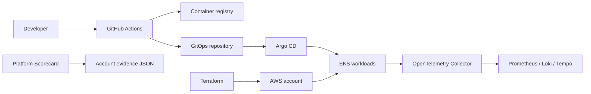

# Platform Engineering Launchpad

[](../../actions/workflows/ci.yml)
[](LICENSE)

An opinionated, production-minded starting point for AWS platform engineering. It brings together a reference architecture, a GitOps starter, reusable Terraform patterns, an operational checklist, and a dependency-free platform scorecard CLI.

## What problem this solves

Platform teams often start with disconnected Terraform, Helm, and CI examples. This repository shows how those parts fit together and gives teams a small assessment tool to prioritize the next improvement.

## Quick start

Requires Node.js 20 or newer.

```bash
node cli/platform-scorecard.mjs assess --input examples/scorecard/account.json
node cli/platform-scorecard.mjs assess --input examples/scorecard/account.json --format json
```

The command prints a score out of 100, category results, and prioritized remediation steps. It reads only the supplied JSON; it never connects to an AWS account.

## Included products

| Area | Start here | Outcome |
| --- | --- | --- |
| Reference architecture | [docs/architecture.md](docs/architecture.md) | AWS/EKS platform design and decisions |
| GitOps starter | [gitops/README.md](gitops/README.md) | Argo CD application and Helm chart baseline |
| Terraform patterns | [terraform/README.md](terraform/README.md) | Small, composable AWS conventions |
| Platform Scorecard | [cli/README.md](cli/README.md) | Assessment CLI with actionable output |
| Production checklist | [docs/kubernetes-production-checklist.md](docs/kubernetes-production-checklist.md) | Reviewable launch checklist |
| Interview guide | [docs/platform-engineering-interview-guide.md](docs/platform-engineering-interview-guide.md) | Practical interview and incident prompts |

## Architecture


## Contributing

Read [CONTRIBUTING.md](CONTRIBUTING.md), open an issue with a reproducible example, and keep changes small and documented. This project follows the [Code of Conduct](CODE_OF_CONDUCT.md).

## License

MIT. See [LICENSE](LICENSE).
